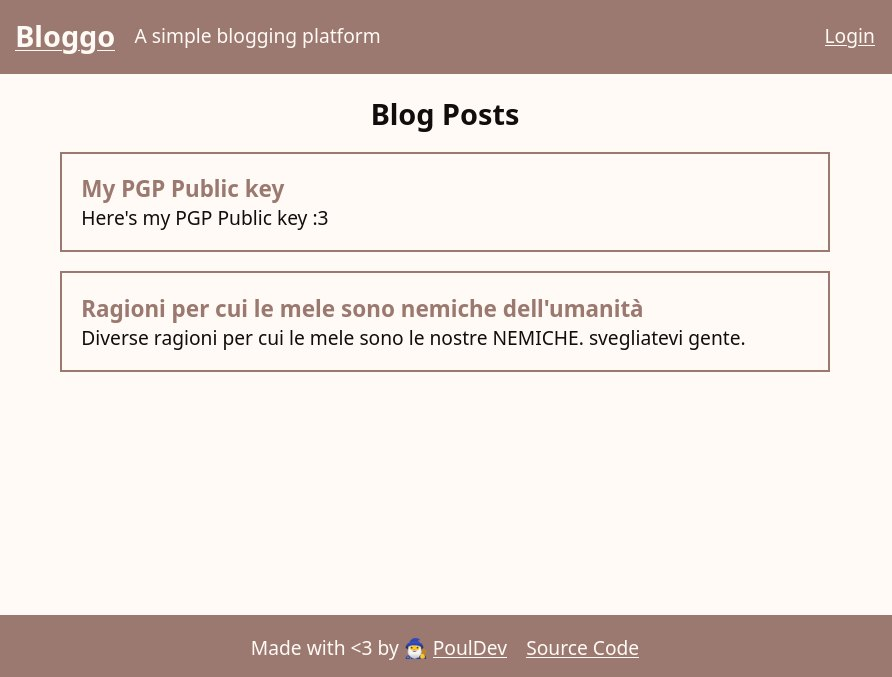

# Bloggo

Bloggo is a simple blogging platform designed to be lightweight and easy to use.

 


## Features
- **Lightweight**: Built using only builtin golang libraries, on `net/http`. The whole database is a small sqlite file. 
- **Customizable**: Easily configure the app title, description, and more through environment variables.
- **Responsive**: Mobile & desktop :D

## Getting Started

> [!WARNING]
> The release is built ONLY for linux, if you want to host it on another operating system, you will need to compile it from scratch.

1. Start by downloading and unzip the bloggo-{date}.tar.gz file from the [latest release](https://github.com/PoulDev/Bloggo/releases/latest).
2. Execute `chmod u+x ./bloggo`
3. Create a .env file with basic configuration, see [Configuration](#configuration), every variable with N/A as the default value must be set. ( `JWT_SECRET` and `PORT` ). See [example `.env` File](#example-env-file)
4. Run `(source .env && ./bloggo)`
5. The admin password will be printed into the console, use it to login to the admin panel.

## Configuration

The application settings are managed through environment variables. Below is a description of each configuration:

| Variable       | Description                                     | Default Value              |
|----------------|-------------------------------------------------|----------------------------|
| `JWT_SECRET`   | A secret key used for signing JWTs. **Required** | N/A                        |
| `PORT`         | The port on which the application will run. **Required** | N/A                        |
| `TITLE`        | The title of the blog.                          | "Bloggo"                   |
| `DESCRIPTION`  | A short description of the blog.                | "A simple blogging platform" |
| `SHOW_CREDITS` | Whether to show credits in the application.     | "true" (set to "false" to disable) |

### Example `.env` File

```plaintext
JWT_SECRET=your_RANDOM_jwt_secret
PORT=8080
TITLE=An Awesome Blog
DESCRIPTION=Awesome stuff posted here!
SHOW_CREDITS=true
```

